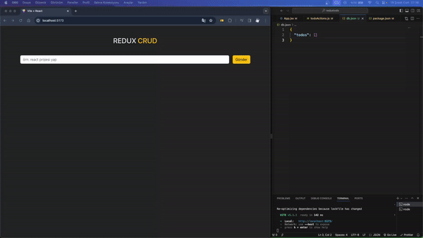

Tabii, aşağıda GitHub deposu için bir açıklama örneği bulabilirsiniz:

---

# Redux CRUD Projesi

Bu proje, React ve Redux kullanılarak geliştirilmiş bir CRUD (Create, Read, Update, Delete) uygulamasını içerir. Temel olarak, kullanıcıların yapabileceği bir görev yöneticisi uygulamasıdır. Kullanıcılar, yeni görevler ekleyebilir, var olan görevleri görüntüleyebilir, güncelleyebilir ve silebilirler.

## Teknolojiler

- React
- Redux
- Axios (HTTP istekleri için)
- Redux Toolkit (Redux işlemleri için kolaylaştırıcı)
- React Redux (React bileşenlerine Redux bağlantısı için)
- Bootstrap (Temalar için)

## Nasıl Çalıştırılır

1. Projeyi klonlayın:

   ```bash
   git clone https://github.com/kullaniciadi/proje-adı.git
   ```

2. Proje dizinine gidin:

   ```bash
   cd proje-adı
   ```

3. Bağımlılıkları yükleyin:

   ```bash
   npm install
   ```

4. Projeyi başlatın:

   ```bash
   npm start
   ```

5. Tarayıcınızda [http://localhost:3000](http://localhost:3000) adresine giderek uygulamayı görüntüleyin.

## Fonksiyonlar

- **Ekleme**: Kullanıcılar yeni görevler ekleyebilir.
- **Güncelleme**: Kullanıcılar var olan görevleri güncelleyebilir.
- **Silme**: Kullanıcılar var olan görevleri silebilir.
- **Listeleme**: Kullanıcılar ekledikleri görevleri bir liste halinde görüntüleyebilir.

## Ekran Görüntüsü


